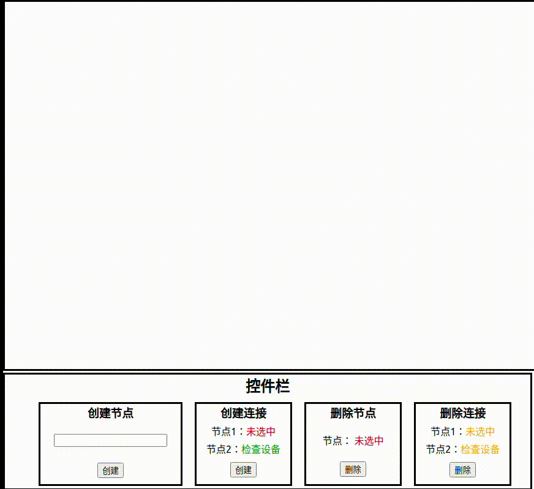

# Skill Map: A Cchema Visualization Tool for Complex Learning

This is tool developed with React and D3.js.\
React Components are used to control the dynamic display of force diagram created by D3 force simulation.

